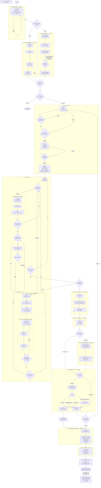

# Fast Track — Diagrama de Fluxo

```mermaid
flowchart TD
    START([🚀 Início]) --> BOOTSTRAP

    subgraph INIT["⚙️ Bootstrap — ft_manager"]
        BOOTSTRAP["ft_bootstrap\n1) git remote -v\n2) setup_env.sh\n3) token_tracker snapshot --step init"]
        BOOTSTRAP -- falhou --> BOOTSTRAP
    end

    BOOTSTRAP -- ok --> MDD_MODE

    MDD_MODE{PRD abrangente\nentregue?}
    MDD_MODE -- normal --> H
    MDD_MODE -- hyper --> HY1

    subgraph HYPER["⚡ Hyper-Mode MDD — ft_coach"]
        HY1[Absorver PRD\ndo stakeholder]
        HY2[Gerar PRD.md\n+ TASK_LIST.md]
        HY3[Gerar questionário\nde alinhamento]
        HY4{Stakeholder\nresponde}
        HY5[Incorporar respostas\nfinalizar artefatos]
        HY1 --> HY2 --> HY3 --> HY4 --> HY5
    end

    HY3 -. "🔍 Pontos Ambíguos\n🕳️ Lacunas\n💡 Sugestões" .-> HY4

    subgraph MDD["📋 Fase 1: MDD normal — ft_coach"]
        H[ft.mdd.01\nhipótese]
        H_DOC["📄 hipotese.md"]
        PRD[ft.mdd.02\nredigir PRD]
        VALPRD2[ft.mdd.03\nvalidar PRD]
        H --> H_DOC --> PRD --> VALPRD2
    end

    HY5 --> VAL_PRD
    VALPRD2 --> VAL_PRD

    VAL_PRD{ft_gatekeeper\ngate.prd}
    VAL_PRD -- falhou --> PRD
    VAL_PRD -- ok --> GO{go / no-go\nhil: ft_manager}

    GO -- rejected --> END_REJ([❌ Encerrado])
    GO -- approved --> TL

    subgraph PLAN["📝 Fase 2: Planning"]
        TL["ft.plan.01\ntask list\n[ft_coach]"]
        VAL_TL{ft_gatekeeper\ngate.task_list}
        SK_PRIO{stakeholder\naprova prioridades}
        STACK["ft.plan.02\ntech stack\n[forge_coder]\n(1º ciclo)"]
        SK_REV{stakeholder\nrevisa stack}
        DIAG["ft.plan.03\ndiagramas\n[forge_coder]\nclass · components\ndatabase · architecture"]

        TL --> VAL_TL
        VAL_TL -- falhou --> TL
        VAL_TL -- ok --> SK_PRIO
        SK_PRIO -- ajustes --> TL
        SK_PRIO -- aprovado --> STACK
        STACK --> SK_REV
        SK_REV -- ajustes --> STACK
        SK_REV -- aprovado --> DIAG
    end

    DIAG --> SPRINT_PREP

    subgraph LOOP["🔁 Loop por Sprint"]
        SPRINT_PREP([alinhar\nsprint atual])
        DEC_PAR{paralelo ou\nsequencial?}

        subgraph PARALLEL["⚡ Paralelo — ft_manager"]
            FANOUT["Fan-out\ncriar worktrees\n(max 3 slots)"]
            WAIT["Aguardar slots"]
            FANIN["Fan-in\nmerge + suite + cleanup"]
            FANOUT --> WAIT --> FANIN
        end

        MORE_PAR{tasks pendentes\napós merge?}

        subgraph TDD["🧪 Fase 3: TDD — forge_coder"]
            SEL[ft.tdd.01\nselecionar task]
            RED[ft.tdd.02\nred — escrever teste]
            GREEN[ft.tdd.03\ngreen — implementar\n+ suite completa]
            SEL --> RED --> GREEN
        end

        subgraph DELIVERY["📦 Fase 4: Delivery — forge_coder"]
            REVIEW[ft.delivery.01\nself-review\n10 itens · 3 grupos]
            REFACTOR[ft.delivery.02\nrefactor]
            COMMIT[ft.delivery.03\ncommit]
            REVIEW --> REFACTOR --> COMMIT
        end

        VAL_ENT{ft_gatekeeper\ngate.delivery\n+ cov >= 85%}
        MORE{tasks pendentes\nna sprint?}
        SPRINT_PREFLIGHT{pre-flight sprint\ngate_log ok?}
        SPRINT_GATE["Sprint Expert Gate\n/ask fast-track"]
        SPRINT_FIX{sprint aprovada?}
        NEXT_SPRINT{próxima sprint\nno ciclo?}

        SPRINT_PREP --> DEC_PAR
        DEC_PAR -- paralelo --> FANOUT
        DEC_PAR -- sequencial --> SEL
        FANIN --> MORE_PAR
        MORE_PAR -- sim --> DEC_PAR
        MORE_PAR -- não --> SPRINT_PREFLIGHT
        GREEN --> REVIEW
        COMMIT --> VAL_ENT
        VAL_ENT -- falhou --> REVIEW
        VAL_ENT -- ok --> MORE
        MORE -- sim --> DEC_PAR
        MORE -- não --> SPRINT_PREFLIGHT
        SPRINT_PREFLIGHT -- gap --> SEL
        SPRINT_PREFLIGHT -- ok --> SPRINT_GATE
        SPRINT_GATE --> SPRINT_FIX
        SPRINT_FIX -- fixing --> SEL
        SPRINT_FIX -- completed --> NEXT_SPRINT
        NEXT_SPRINT -- sim --> SPRINT_PREP
    end

    NEXT_SPRINT -- não --> PREFLIGHT_CICLO

    PREFLIGHT_CICLO{pre-flight ciclo\ngate_log ok?}
    PREFLIGHT_CICLO -- gap --> SEL
    PREFLIGHT_CICLO -- ok --> SMOKE

    subgraph SMOKE_GATE["🔥 Fase 5a: Smoke Gate — forge_coder"]
        SMOKE[ft.smoke.01\ncli run]
        SMOKE_R["📄 smoke-cycle-XX.md\noutput real documentado"]
        SMOKE_MVP["set mvp_status: demonstravel"]
        SMOKE --> SMOKE_R --> SMOKE_MVP
    end

    SMOKE_MVP --> E2E

    subgraph E2E_GATE["🔒 Fase 5b: E2E Gate — forge_coder"]
        E2E[ft.e2e.01\ncli validation\nunit + smoke]
    end

    E2E --> ACCEPT_DEC

    ACCEPT_DEC{interface_type\n!= cli_only?}
    ACCEPT_DEC -- "cli_only — skip" --> MODO
    ACCEPT_DEC -- api/ui/mixed --> ACCEPT

    subgraph ACCEPTANCE_GATE["🎯 Fase 5c: Acceptance Gate — forge_coder"]
        ACCEPT[ft.acceptance.01\ninterface validation\nACs × interface real]
        ACCEPT_R["📄 acceptance-cycle-XX.md\nmapeamento US→AC→Teste"]
        ACCEPT --> ACCEPT_R
    end

    ACCEPT_R --> MODO

    subgraph STAKEHOLDER["👥 Decisão de Ciclo — ft_manager"]
        MODO{stakeholder\nmode?}
        APRESENTA[Apresentar ciclo\nao stakeholder]
        SK_DEC{decisão}
        SET_AUTO[set autonomous]
        MVP_ENTREGUE[Apresentar\nMVP final report]

        MODO -- interactive --> APRESENTA
        APRESENTA --> SK_DEC
        SK_DEC -- novo ciclo --> RETRO
        SK_DEC -- changes requested --> RETRO
        SK_DEC -- MVP concluído --> MVP_ENTREGUE
        SK_DEC -- continue sem validação --> SET_AUTO
        SET_AUTO --> RETRO
    end

    MODO -- autonomous --> RETRO

    MVP_ENTREGUE --> RETRO_FINAL

    subgraph FEEDBACK["📊 Fase 6: Feedback — ft_coach"]
        RETRO[ft.feedback.01\nretro note]
    end

    RETRO_FINAL["ft.feedback.01\nretro note (final)"]

    RETRO --> CONTINUAR{continuar?\nhil: ft_manager}
    CONTINUAR -- novo ciclo --> TL
    CONTINUAR -- encerrar --> AUDIT

    RETRO_FINAL --> AUDIT

    subgraph AUDIT_PHASE["🔍 Fase 8: Auditoria ForgeBase — forge_coder"]
        AUDIT[ft.audit.01\nForgeBase audit]
        AUDIT_ITEMS["UseCaseRunner wiring\nValue/Support Tracks\nPulse snapshot\nLogging quality\nClean/Hex"]
        AUDIT --> AUDIT_ITEMS
    end

    AUDIT_ITEMS --> HANDOFF

    subgraph HANDOFF_PHASE["📄 Fase 9: Handoff — ft_coach"]
        HANDOFF[ft.handoff.01\ngerar SPEC.md\n+ CHANGELOG + BACKLOG]
    end

    HANDOFF --> SET_MAINT["set maintenance_mode: true\nmvp_delivered: true\nmvp_status: entregue"]
    SET_MAINT --> END_OK([✅ Projeto concluído\nmaintenance_mode ativo])

    END_OK -. "🔧 Manutenção via\n/feature descrição" .-> FEATURE_NOTE["📝 /feature lê SPEC.md\nantes de implementar\natualiza SPEC.md\nao finalizar"]
```
