# Fast Track V3 - Fluxo do Processo

Fonte: `templates/fast-track-v3/process.yml`.

```mermaid
flowchart TD
  START{"PRD existe?"}

  START -- "nao" --> HIPO["Capturar Hipotese"]
  HIPO --> HIPO_GATE["Human gate: Hipotese"]
  HIPO_GATE -- "rejeita" --> HIPO
  HIPO_GATE --> PRD["Redigir PRD"]
  PRD --> PRD_GATE["Human gate: PRD"]
  PRD_GATE -- "rejeita" --> PRD
  PRD_GATE --> MDD_GATE["Gate MDD"]
  MDD_GATE --> UI_ROUTE{"ui_criteria existe?"}

  START -- "sim" --> UI_ROUTE
  UI_ROUTE -- "nao" --> UI_Q["Perguntas para criterios visuais"]
  UI_Q --> UI_DISC["Descobrir criterios visuais"]
  UI_DISC --> UI_GATE["Human gate: criterios visuais"]
  UI_GATE -- "rejeita" --> UI_DISC
  UI_GATE --> BACKLOG_ROUTE

  UI_ROUTE -- "sim" --> BACKLOG_ROUTE{"PROJECT_BACKLOG existe?"}
  BACKLOG_ROUTE -- "nao" --> BACKLOG["Criar PROJECT_BACKLOG"]
  BACKLOG_ROUTE -- "sim" --> FEATURES_ROUTE{"FEATURES existe?"}
  BACKLOG --> FEATURES_ROUTE
  FEATURES_ROUTE -- "nao" --> FEATURES["Criar/reconciliar FEATURES"]
  FEATURES_ROUTE -- "sim" --> PLAN_TASKS
  FEATURES --> PLAN_TASKS["Criar task list do ciclo"]

  subgraph PLANNING["Sprint 02 - Planning"]
    PLAN_TASKS --> TECH["Definir tech stack"]
    TECH --> TECH_GATE["Human gate: tech stack"]
    TECH_GATE -- "rejeita" --> TECH
    TECH_GATE --> API["Definir contrato de API"]
    API --> UI_CRIT["Gerar criterios visuais"]
    UI_CRIT --> TEST_DATA["Gerar massa de dados"]
    TEST_DATA --> PLAN_GATE["Gate Planning"]
  end

  subgraph FRONTEND["Sprint 03 - Frontend"]
    PLAN_GATE --> FE_SCAFFOLD["Scaffold frontend"]
    FE_SCAFFOLD --> FE_IMPL["Implementar frontend"]
    FE_IMPL --> FE_PRD_REVIEW["Revisao PRD"]
    FE_PRD_REVIEW -- "falha" --> FE_IMPL
    FE_PRD_REVIEW --> FE_SCREEN["Screenshot review"]
    FE_SCREEN -- "falha" --> FE_IMPL
    FE_SCREEN --> FE_GATE["Gate Frontend"]
  end

  subgraph TDD["Sprint 04 - TDD Backend"]
    FE_GATE --> RED["Red: escrever testes"]
    RED --> GREEN["Green: implementar backend"]
    GREEN --> REFACTOR["Refactor"]
    REFACTOR --> TDD_GATE["Gate TDD"]
  end

  subgraph DELIVERY["Sprint 05 - Delivery"]
    TDD_GATE --> ENTRY["Criar entrypoint HTTP"]
    ENTRY --> SELF_REVIEW["Self-review"]
    SELF_REVIEW --> MAKEFILE["Criar Makefile e serve.sh"]
    MAKEFILE --> DELIVERY_GATE["Gate Delivery"]
  end

  subgraph SMOKE_ACCEPTANCE_E2E["Sprints 06-08 - Smoke, Acceptance, E2E"]
    DELIVERY_GATE --> SMOKE["Smoke test"]
    SMOKE --> SMOKE_GATE["Gate Smoke"]
    SMOKE_GATE --> ACCEPT["Acceptance CLI"]
    ACCEPT --> ACCEPT_GATE["Gate Acceptance"]
    ACCEPT_GATE --> E2E_CONFIG["Configurar E2E"]
    E2E_CONFIG --> E2E_RUN["Executar E2E + screenshots"]
    E2E_RUN --> E2E_GATE["Gate E2E"]
  end

  subgraph FINAL["Sprint 09 - Final"]
    E2E_GATE --> VISUAL["Verificacao visual final"]
    VISUAL --> VISUAL_GATE["Gate Visual Check"]
    VISUAL_GATE --> STAKE["Human gate: stakeholder"]
    STAKE -- "rejeita" --> STAKE_FIX["Correcao stakeholder"]
    STAKE_FIX --> STAKE
  end

  subgraph HANDOFF["Sprint 10 - Handoff"]
    STAKE --> RETRO["Retro do ciclo"]
    RETRO --> BACKLOG_UPDATE["Atualizar PROJECT_BACKLOG + progresso"]
    BACKLOG_UPDATE --> FEATURES_UPDATE["Atualizar FEATURES entregues"]
    FEATURES_UPDATE --> PRD_REWRITE["Gerar PRD.next"]
    PRD_REWRITE --> CRITICAL["Analise critica"]
    CRITICAL --> FLIGHT_PLAN["Plano de voo + handoff"]
    FLIGHT_PLAN --> HANDOFF_GATE["Human gate: handoff"]
    HANDOFF_GATE -- "rejeita" --> FLIGHT_PLAN
    HANDOFF_GATE --> PROCESS_EVOLVE["Meta-melhoria do processo"]
  end

  PROCESS_EVOLVE --> EXPLORE["Exploracao livre opcional"]
  EXPLORE --> END(["MVP entregue"])
```

Após o grafo terminar, `ft close` executa uma etapa da engine que não é um node do
processo: preserva PRD, stack, critérios de UI, `PROJECT_BACKLOG` e `FEATURES` em `docs/`, move os
artefatos específicos da execução para `.ft/cycles/<cycle>/`, grava `cycle.yml` e só
então faz o merge da worktree.
