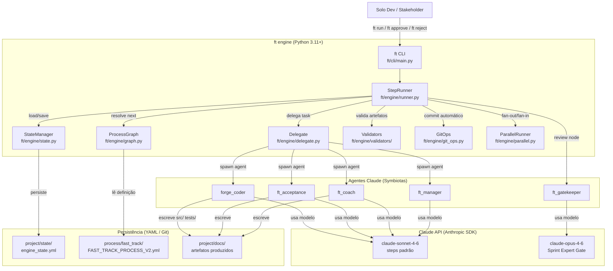
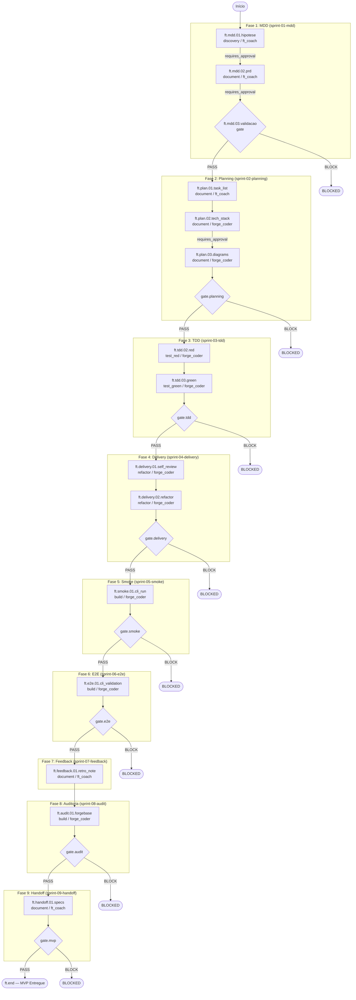
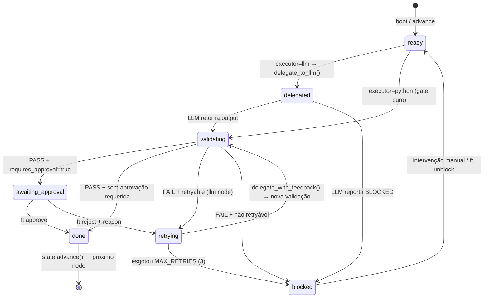
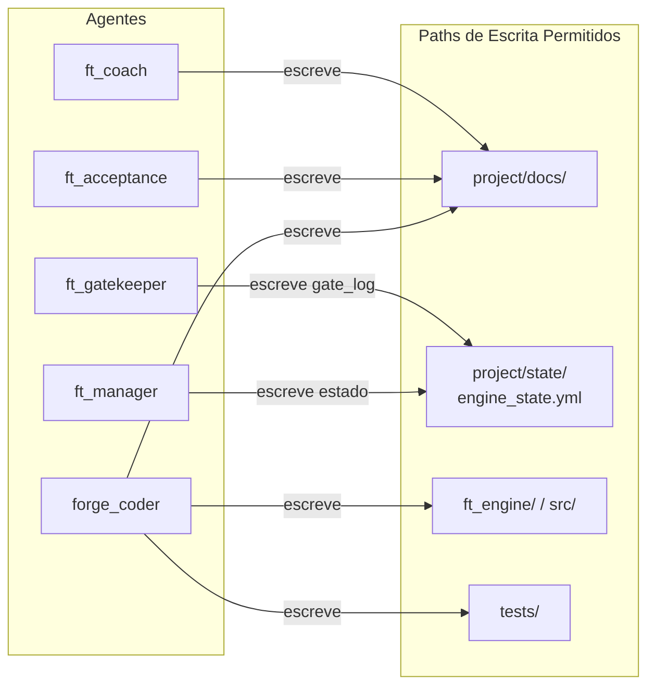
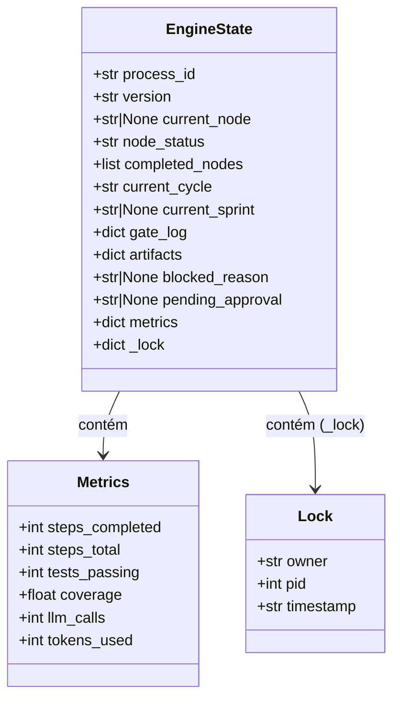
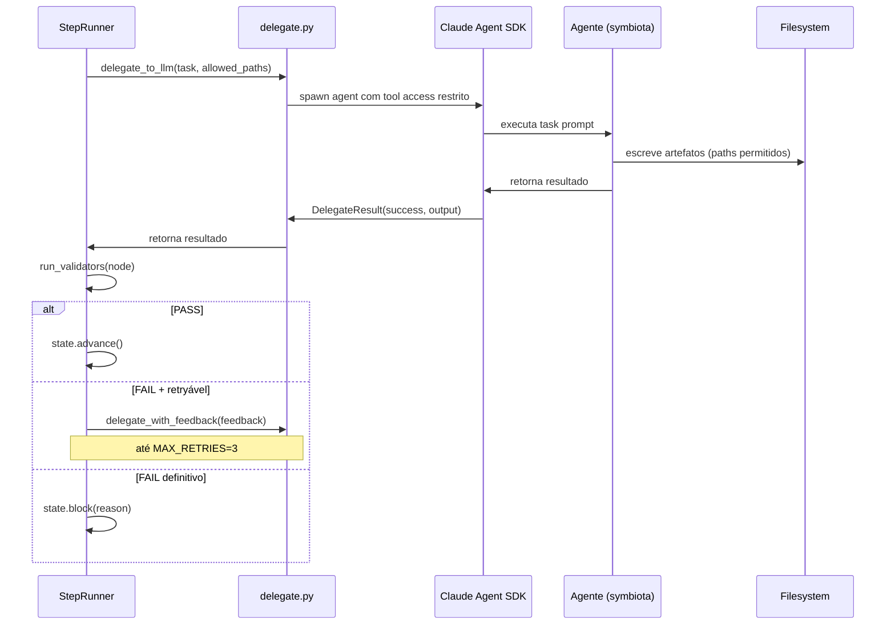

# Diagramas de Arquitetura — ForgeProcess Fast Track

**Versão:** 1.0
**Data:** 2026-04-01
**Processo:** fast_track_v2 / ft.plan.03.diagrams
**Status:** Pronto para revisão

---

## 1. Visão Geral do Sistema



---

## 2. Fluxo de Processo — 9 Fases / 19 Steps



---

## 3. Ciclo de Vida de um Node (StepRunner)



---

## 4. Isolamento de Paths por Agente



---

## 5. Estrutura de Pastas

```
fast-track/
├── pyproject.toml              # config: deps, ruff, mypy, pytest
├── ft/                         # motor determinístico
│   ├── cli/
│   │   └── main.py             # CLI: ft init | run | status | approve | reject
│   └── engine/
│       ├── runner.py           # StepRunner — loop principal
│       ├── state.py            # StateManager — leitura/escrita engine_state.yml
│       ├── graph.py            # ProcessGraph — carrega FAST_TRACK_PROCESS_V2.yml
│       ├── delegate.py         # Delegação ao Claude Agent SDK
│       ├── git_ops.py          # Auto-commit após PASS
│       ├── parallel.py         # ParallelRunner — fan-out/fan-in via worktrees
│       ├── stakeholder.py      # Hyper-mode, prompts de rejeição
│       └── validators/
│           ├── artifacts.py    # file_exists, min_lines, has_sections, ...
│           ├── tests.py        # tests_exist, tests_pass, coverage_per_file
│           ├── code.py         # lint_clean, format_check, no_todo_fixme
│           ├── gates.py        # gate_delivery, gate_smoke, gate_mvp
│           └── review.py       # no_large_files, changed_files_have_tests
├── src/                        # código produzido pelo forge_coder
├── tests/
│   ├── unit/                   # testes unitários (mocked)
│   └── e2e/                    # cenários E2E (AC-01 a AC-05)
├── process/
│   └── fast_track/
│       └── FAST_TRACK_PROCESS_V2.yml   # definição do grafo de processo
└── project/
    ├── state/
    │   └── engine_state.yml    # estado persistente (único escritor: ft engine)
    └── docs/                   # artefatos produzidos pelos agentes
        ├── hipotese.md
        ├── PRD.md
        ├── TASK_LIST.md
        ├── tech_stack.md
        ├── diagrams/
        │   └── architecture.md
        └── sessions/           # logs de sessão dos agentes
```

---

## 6. Modelo de Estado (`engine_state.yml`)



**Transições de `node_status`:**

| Status | Descrição |
|--------|-----------|
| `ready` | Aguardando execução |
| `delegated` | LLM em execução |
| `validating` | Validadores rodando |
| `awaiting_approval` | Aguarda `ft approve` |
| `blocked` | Gate falhou / LLM bloqueou |
| `done` | Processo completo |

---

## 7. Fluxo de Delegação ao LLM



---

## 8. Gate de Qualidade — Critérios por Fase

| Gate | Validators obrigatórios | Resultado |
|------|------------------------|-----------|
| `ft.mdd.03.validacao` | `file_exists` hipotese.md + PRD.md, `min_lines: 30` | PASS / BLOCK |
| `gate.planning` | `file_exists` TASK_LIST + tech_stack + diagrams | PASS / BLOCK |
| `gate.tdd` | `tests_pass: true` | PASS / BLOCK |
| `gate.delivery` | `tests_pass`, `lint_clean`, `format_check` | PASS / BLOCK |
| `gate.smoke` | `file_exists` smoke-report.md, `min_lines: 10` | PASS / BLOCK |
| `gate.e2e` | `tests_pass: true` (tests/e2e/) | PASS / BLOCK |
| `gate.audit` | `file_exists` forgebase-audit.md, `tests_pass`, `lint_clean` | PASS / BLOCK |
| `gate.mvp` | `file_exists` PRD + TASK_LIST + SPEC + CHANGELOG, `tests_pass` | PASS / BLOCK |

**Regra invariante:** Gates `BLOCK` nunca podem ser contornados sem intervenção explícita (`ft unblock`). `ft_gatekeeper` retorna apenas `PASS` ou `BLOCK` — sem estados intermediários (RF-13).

---

## 9. Decisões de Design Relevantes para Arquitetura

| ID | Decisão | Impacto na Arquitetura |
|----|---------|----------------------|
| TD-01 | YAML para estado persistente | `engine_state.yml` é o único source of truth; auditável via git diff |
| TD-03 | SDK Anthropic direto (sem LangChain) | `delegate.py` é thin wrapper; sem abstração de agente intermediária |
| TD-04 | Python puro (sem async) | `StepRunner` é síncrono; `ParallelRunner` usa worktrees + processos |
| TD-05 | `dict` + YAML (sem Pydantic) | `StateManager` serializa/deserializa com `yaml.safe_load` + `yaml.dump` |
