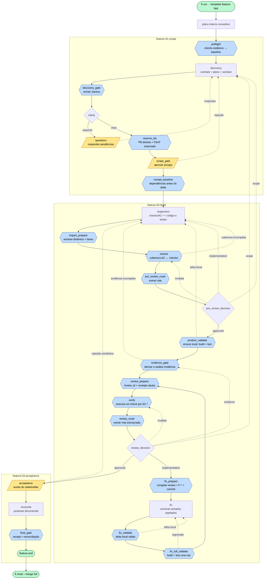

# Feature Fast — Diagrama de Fluxo

Fluxo do processo definido em [`process.yml`](./process.yml)
(`id: feature_fast`, versão `2.0.0`). O template executa um ciclo independente
por demanda, precedido por um plano interno consultivo. O grafo e seus gates
continuam autoritativos.

## Legenda

| Forma | Tipo de node |
|---|---|
| Hexágono | `gate` determinístico |
| Retângulo | node LLM focal |
| Losango | `decision` determinístico |
| Paralelogramo | `human_gate` |
| Estádio | início/fim |

## Fluxo

## Salvaguardas de desempenho

- `preflight` e os demais gates caros usam `validation_mode: fail_fast`; checks
  estáticos vêm antes de build/test.
- Demandas com mais de 6 ACs voltam ao discovery para serem divididas em
  fatias verticais de 4–6 ACs; um único ciclo não absorve escopo gigante.
- `impact_prepare` expande o workset pelo delta e por testes/pares relacionados.
  `pre_review` detecta defeitos semânticos antes de pagar o build/test completo.
- `implement` não produz evidência narrativa. `product_validate` roda a suíte
  completa uma vez por snapshot e `ensure` reutiliza somente o receipt local
  válido.
- `evidence_gate` deriva relatório e evidência do receipt executado e audita
  as referências; o veredicto por AC-* fica em `verify`, o único gate que
  executa os checks.
- `checks` e `verify` substituem as três revisões por LLM. Cada AC-* tem um
  `checks/AC-NNN.py` escrito antes da implementação e ancorado no código de
  produção; a qualidade deles é medida por mutação no aceite do stakeholder.
- Uma rejeição de implementação não reinicia `implement → evidence → review`.
  Ela congela os F-* e executa `fix → fix_validate → fix_full_validate`;
  a atestação é refeita do zero em `verify`. Apenas
  expansão do workset/contrato retorna ao caminho completo.
- Tentativas intermediárias do fix executam somente a validação focal.
  `fix_full_validate` paga build+test e renova receipts uma única vez, antes
  de a atestação ser refeita.
- Toda review recebe um ID ligado ao snapshot atual. Receipts adicionais
  declaram seus paths: uma lane física só é refeita quando essas dependências
  mudam, inclusive durante um fix focal; caso contrário, sua prova anterior é
  reutilizada explicitamente.
- O episódio de implementação herda a lease global de produtividade: a janela
  temporal dispara sondas e é renovada por stream, worktree ou processo ativo.
  O orçamento cumulativo é telemetria; rotas semânticas `implementation` e
  `scope`, além de rejeição humana legítima, iniciam um episódio novo.
- `reconcile` propõe conteúdo estruturado, o engine valida IDs autorizados e só
  então aplica os documentos canônicos.
- Ciclos paralelos exigem PBs preexistentes distintos. FEATs novos são
  reservados sob lock curto, e o close tenta a reconciliação conservadora de
  CHANGELOG, backlog e catálogo antes de pedir merge manual.
