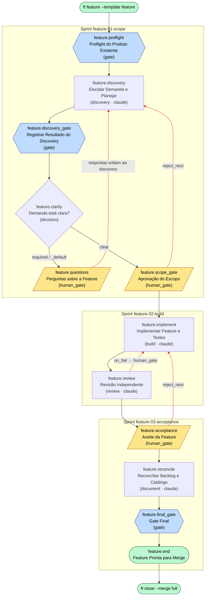

# Feature — Diagrama de Fluxo

Fluxo do processo definido em [`process.yml`](./process.yml) (`id: feature`,
versão `1.2.0`). Gerado a partir dos `nodes`, seus `next`, `branches`,
`reject_next` e `on_fail`.

## Legenda

| Forma | Tipo de node |
|---|---|
| Hexágono | `gate` (validação determinística) |
| Retângulo | `discovery` / `build` / `review` / `document` (executor de agente) |
| Losango | `decision` (branch por condição) |
| Paralelogramo | `human_gate` (aprovação humana) |
| Estádio | `end` |

Arestas tracejadas em vermelho são caminhos de **rejeição / correção** que
voltam o ciclo para trás.

## Fluxo

## Resumo dos caminhos

- **Caminho feliz:** `preflight → discovery → discovery_gate → clarity(clear) →
  scope_gate → implement → review → acceptance → reconcile → final_gate → end`.
- **Loop de clarificação:** `clarity(required) → questions → discovery →
  discovery_gate` — repete até o discovery marcar
  `clarification_status: clear`.
- **Rejeição de escopo:** `scope_gate` (reject) volta para `discovery`.
- **Falha de revisão:** `review` com `on_fail` abre um human_gate e retorna para
  `implement`.
- **Rejeição no aceite:** `acceptance` (reject) volta para `implement`, repetindo
  `make build` / `make test`.
