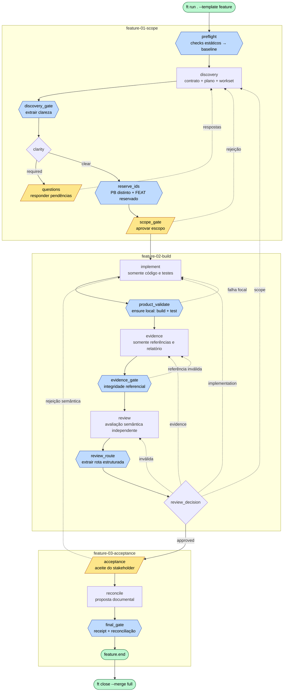

# Feature — Diagrama de Fluxo

Fluxo do processo definido em [`process.yml`](./process.yml) (`id: feature`,
versão `1.3.0`). O template continua executando um ciclo independente por
demanda; não existe planner, wave ou batch oculto.

## Legenda

| Forma | Tipo de node |
|---|---|
| Hexágono | `gate` determinístico |
| Retângulo | node LLM focal |
| Losango | `decision` determinístico |
| Paralelogramo | `human_gate` |
| Estádio | início/fim |

## Fluxo

## Salvaguardas de desempenho

- `preflight` e os demais gates caros usam `validation_mode: fail_fast`; checks
  estáticos vêm antes de build/test.
- `implement` não produz evidência narrativa. `product_validate` roda a suíte
  completa uma vez por snapshot e `ensure` reutiliza somente o receipt local
  válido.
- `evidence` não altera código e o gate seguinte comprova apenas referências;
  a suficiência semântica permanece na review.
- O episódio de implementação tem deadline por chamada e orçamento cumulativo.
  Rotas semânticas `implementation` e `scope`, além de rejeição humana legítima,
  iniciam um episódio novo; esgotamento pausa preservando o diff.
- `reconcile` propõe conteúdo estruturado, o engine valida IDs autorizados e só
  então aplica os documentos canônicos.
- Ciclos paralelos exigem PBs preexistentes distintos. FEATs novos são
  reservados sob lock curto, e o close tenta a reconciliação conservadora de
  CHANGELOG, backlog e catálogo antes de pedir merge manual.
