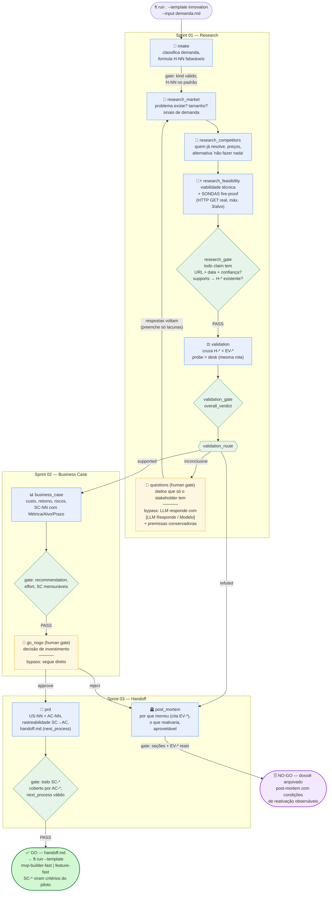

# Innovation — Fluxo do Processo (v0.2.0)

Grafo executável de `process.yml`: 14 nodes, dois desfechos legítimos
(handoff/go e post-mortem/no-go) num único `end`. LLM executa pesquisa e
julgamento; Python executa gates determinísticos; humanos decidem nos dois
human gates (bypassáveis com `--bypass-human-gates`).

## Legenda

| Cor | Executor | Papel |
|---|---|---|
| 🔵 Azul | LLM (claude) | Pesquisa, julgamento e escrita — nunca decide rota |
| 🟢 Verde | Python | Gates determinísticos e decisions — binários, auditáveis |
| 🟡 Amarelo | Humano | `questions` (condicional) e `go_nogo` (investimento) |

## Garantias determinísticas por gate

- **intake**: `kind: product|process|mixed`; toda hipótese no padrão `## H-NN — afirmação`.
- **research_gate**: claim sem URL/data/confiança bloqueia; `supports` órfão bloqueia; hipótese sem claim bloqueia.
- **validation_gate**: todo H-* com verdict; verdict sem EV-* citado bloqueia; EV-* inexistente bloqueia.
- **business_case gate**: `recommendation: go|no_go`; todo SC-* com Métrica/Alvo/Prazo preenchidos.
- **prd_gate**: todo SC-* do business case coberto por AC-* na tabela de rastreabilidade; `next_process: mvp-builder-fast|feature-fast`.
- **post_mortem gate**: seções obrigatórias; "por que morreu" cita EV-* reais do dossiê.

## Propriedades do desenho

- **No-go é sucesso**: matar uma ideia barata, com dossiê auditável e condições
  de reativação, é entrega de valor — três das quatro investigações do Clari
  terminaram aqui em ~30 min cada.
- **Sondas fire-proof** (v0.2.0): claim decisivo verificável por HTTP GET vira
  observação direta (`method: probe`, resposta bruta salva) e prevalece sobre
  desk research da mesma rota.
- **Ciclo descartável**: cada run é uma worktree isolada; `ft close --merge full`
  leva só os artefatos canônicos ao checkout; o dossiê completo fica em
  `.ft/cycles/<cycle>/`.
