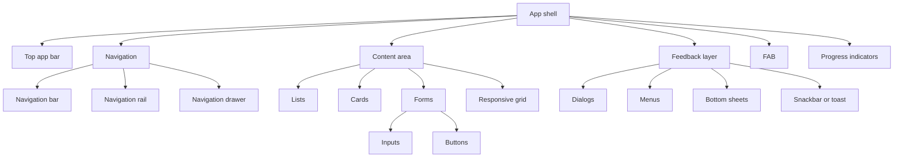
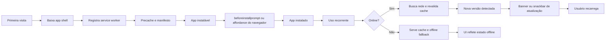

<!-- Guidelines embarcadas do template material_design_pwa (Fast Track).
     Fonte: manual prático de Material Design 3 / M3 Expressive para PWAs
     (deep research, 2026-07). Citações removidas para uso offline. -->

# Manual prático de Material Design para PWAs

## Resumo executivo

A base oficial mais atual do Material continua sendo o **Material Design 3**, descrito pelo próprio site do Material como o “latest open source design system” do Google. Ao mesmo tempo, a evolução mais recente apresentada pela documentação oficial é o **Material 3 Expressive**, que expande o M3 com motion theming mais avançado, layout mais expressivo, tipografia mais enfática e componentes adaptativos — sem anunciar uma “Material Design 4” separada. Em outras palavras: para web e PWA, o alvo correto hoje é **M3 como sistema**, com atenção especial às atualizações **M3 Expressive**.

Para times que constroem PWAs, a decisão prática é simples: use **Material como linguagem de produto**, mas não assuma que a biblioteca oficial para web cobre todo o catálogo de componentes. O **@material/web** oferece componentes úteis e compatíveis com tokens CSS para botões, campos, diálogos, listas, menus, FAB, tabs e indicadores de progresso, porém o próprio projeto informa que está em **maintenance mode pending new maintainers**, e o roadmap oficial ainda listava várias peças de navegação e layout como futuras ou em construção. Resultado: em PWAs reais, vale combinar **tokens do Material + HTML semântico/CSS próprio + componentes do Material Web onde eles já ajudam**.

O manual abaixo parte desse cenário. Ele assume um PWA instalável, responsivo, acessível e offline-first; privilegia docs oficiais do Material, do Google Web Dev/Chrome e da W3C; e traduz isso para decisões de design e implementação que um time de design/front-end consegue aplicar sem firula. Ou, dito de forma mais honesta: o objetivo não é “ficar bonito no Figma”, é **não quebrar no celular ruim, no tablet esquecido e no desktop do usuário offline**.

## Escopo e audiência

Este guia é para **designers, front-end developers e agentes que constroem interfaces de PWAs**. O foco não é Android nativo, iOS nativo nem uma framework específica; é **web instalável**, com app shell, navegação adaptativa, feedback transitório, formulários consistentes, atualização controlada e comportamento aceitável sem rede. O Material define componentes, princípios e breakpoints; as docs de PWA do Google completam isso com manifesto, service workers, instalação, fallback offline e estratégias de cache.

O Material também organiza layouts adaptativos em torno de breakpoints e layouts canônicos, como **feed**, **list-detail** e **supporting pane**, com comportamentos diferentes para janelas compactas, médias e expandidas. Para PWAs, isso é ouro: pare de desenhar “mobile e desktop” como dois mundos separados; desenhe **um sistema que refluí do compacto ao expandido**.

A tabela a seguir sintetiza os breakpoints oficiais e uma adaptação prática para shell de PWA. Os intervalos vêm da guidance oficial; o mapeamento para padrões de navegação web é uma adaptação prática baseada nos componentes de navegação do Material.

| Faixa| Largura oficial| Regra de layout| Navegação PWA sugerida| Base|
|---|---:|---|---|---|
| Compacta| `< 600dp`| 1 pane| **Navigation bar** inferior para destinos de topo||
| Média| `600–839dp`| 1 pane, às vezes 2| **Navigation rail** ou drawer modal||
| Expandida| `840–1199dp`| 2 panes| **Navigation rail**; em casos densos, rail expandido||
| Grande| `1200–1599dp`| 2+ panes| **Drawer persistente** ou rail expandido||
| Extra-grande| `>= 1600dp`| 2–3 panes| **Drawer persistente** e layout com supporting pane||

Na web, trate esses valores em **dp** como referência de projeto e comece testando os mesmos cortes em **CSS px**, ajustando com analytics e testes reais. Não é dogma; é ponto de partida sensato. O que não funciona é ter um breakpoint “tablet” inventado no chute e descobrir depois que seu rail virou sanduíche de ícones.

## Tokens e sistema visual

O Material organiza seu sistema em **reference tokens**, **system tokens** e **component tokens**. Em Material Web, esses tokens são expostos como **CSS custom properties**, o que é excelente para PWAs porque permite tematização consistente entre design e código com pouco atrito.

A parte mais importante para uma PWA não é decorar nomes de tokens; é entender **o que precisa virar contrato entre design e front-end**. Se o time concorda em tokens de cor, tipo, espaçamento, elevação, motion e ícones, o resto para de virar discussão filosófica toda sprint.

| Categoria| O que padronizar| Regra prática para PWA| Base|
|---|---|---|---|
| Cor| Roles como `primary`, `secondary`, `tertiary`, `error`, `surface`, `outline`; o sistema oficial tem **26 color roles**| Mapeie cor por **papel**, não por hex solto. Guarde hex só em reference tokens||
| Tipografia| Roles `display`, `headline`, `title`, `body`, `label`; o M3 tem **30 type styles**| Use poucos estilos no produto: 1–2 para heading, 1 body, 1 label e 1 mono/opcional; economiza inconsistência||
| Espaçamento| Grid base de **8dp** e alinhamento fino em **4dp**| Defina sua própria escala CSS como `4/8/12/16/24/32...`; o próprio roadmap web admite que spacing/density ainda não está completo||
| Elevação| Indica relação entre componentes; pode usar sombra, tom e scrim| Em web, use **pouca sombra** e mais contraste de superfície; reserve elevação forte para overlays||
| Motion| O sistema físico mais novo tem **duas schemes**: `standard` e `expressive`| Use `standard` para fluxo utilitário e `expressive` só onde há benefício real; não transforme tudo em parque de diversões||
| Ícones| Material Symbols com estilos `outlined`, `rounded`, `sharp` e eixos `fill`, `weight`, `grade`, `optical size`| Use ícones como parte do estado e da hierarquia; não como confete visual||

Em cor, o M3 continua forte porque relaciona roles a superfícies e elementos. A vantagem prática para PWAs é que você consegue padronizar estados claro/escuro, branding e contraste por papel sem redesenhar tudo. Se quiser gerar esquemas a partir de uma cor-fonte, use o **Material Theme Builder** ou a biblioteca oficial **Material Color Utilities**.

Em tipografia, o M3 simplificou a nomenclatura comparado a versões anteriores. Para uma PWA, a melhor leitura operacional é: **display/headline** para destaque, **title** para títulos de seção e cards, **body** para conteúdo, **label** para botões e metadados. A nova camada Expressive também enfatiza pesos, tamanhos e espaçamento como recurso de hierarquia — mas isso deve melhorar a escaneabilidade, não sabotar ela.

Em motion, a atualização mais recente do Material introduz um sistema físico baseado em molas, com esquemas **standard** e **expressive**. Porém há um detalhe importante para web: a própria documentação do Material Web informa que **tokens de motion ainda não têm suporte completo**. Portanto, em PWA, trate motion como **tokens locais de CSS/JS**, alinhados ao Material, e não como algo que a biblioteca resolverá sozinha.

Abaixo está um exemplo de contrato de tokens em CSS. Ele combina tokens do Material Web com uma escala de spacing local, justamente porque a parte de spacing/density ainda não está fechada no ecossistema web oficial.

```css
:root {
  /* Reference tokens */
  --md-ref-typeface-brand: "Roboto Flex", "Roboto", system-ui, sans-serif;
  --md-ref-typeface-plain: "Roboto", system-ui, sans-serif;

  /* System color tokens */
  --md-sys-color-primary: #0057d8;
  --md-sys-color-on-primary: #ffffff;
  --md-sys-color-primary-container: #d9e2ff;
  --md-sys-color-on-primary-container: #001945;

  --md-sys-color-surface: #fcf8f8;
  --md-sys-color-surface-container: #f1ecec;
  --md-sys-color-surface-container-high: #ebe6e6;
  --md-sys-color-surface-container-highest: #e5e0df;
  --md-sys-color-on-surface: #1b1b1f;
  --md-sys-color-on-surface-variant: #44474f;
  --md-sys-color-outline: #74777f;
  --md-sys-color-error: #ba1a1a;

  /* Typography tokens */
  --md-sys-typescale-title-large-font: 500 1.375rem/1.75rem var(--md-ref-typeface-brand);
  --md-sys-typescale-body-large-font: 400 1rem/1.5rem var(--md-ref-typeface-plain);
  --md-sys-typescale-label-large-font: 500 0.875rem/1.25rem var(--md-ref-typeface-plain);

  /* Shape tokens */
  --md-sys-shape-corner-extra-small: 4px;
  --md-sys-shape-corner-small: 8px;
  --md-sys-shape-corner-medium: 12px;
  --md-sys-shape-corner-large: 16px;
  --md-sys-shape-corner-full: 999px;

  /* Local spacing tokens */
  --space-1: 4px;
  --space-2: 8px;
  --space-3: 12px;
  --space-4: 16px;
  --space-6: 24px;
  --space-8: 32px;

  /* Local motion tokens aligned to M3 intent */
  --motion-fast: 120ms;
  --motion-medium: 220ms;
  --motion-slow: 320ms;
  --easing-standard: cubic-bezier(0.2, 0, 0, 1);
}

@media (prefers-color-scheme: dark) {
:root {
    --md-sys-color-primary: #adc6ff;
    --md-sys-color-on-primary: #002e69;
    --md-sys-color-primary-container: #004494;
    --md-sys-color-on-primary-container: #d9e2ff;

    --md-sys-color-surface: #121316;
    --md-sys-color-surface-container: #1e2024;
    --md-sys-color-surface-container-high: #282a2f;
    --md-sys-color-surface-container-highest: #33353a;
    --md-sys-color-on-surface: #e3e2e6;
    --md-sys-color-on-surface-variant: #c4c6d0;
    --md-sys-color-outline: #8e9099;
  }
}
```

## Componentes e adaptações para web e PWA

O catálogo do Material continua amplo, mas o **catálogo de guidance** e o **catálogo implementado no @material/web** não são idênticos. Esse é o ponto que costuma pegar times desprevenidos: o design system sugere uma coisa; a biblioteca web entrega outra, parcial. Por isso, a estratégia correta para PWA é separar **componentes de conteúdo e formulário**, que já têm boa base no Material Web, dos **componentes de shell e navegação**, que frequentemente exigem HTML/CSS próprio.

| Componente| Regra prática para PWA| Adaptação web| Status em `@material/web`| Base|
|---|---|---|---|---|
| Top app bar| Use para título da tela, back e 1–2 ações essenciais| Em M3 Expressive, prefira variantes flexíveis; implemente shell manualmente em HTML/CSS| **Ainda não como componente principal**; listado como futuro no roadmap||
| Navigation bar| Use em telas pequenas para destinos de topo| Fundo fixo inferior, no máximo poucas rotas primárias| **Futuro** no roadmap web; faça manualmente||
| Navigation rail| Use em telas médias e expandidas| Bom para tablet e desktop estreito; pode conviver com FAB| **Futuro** no roadmap web; faça manualmente||
| Navigation drawer| Use em telas grandes| Prefira persistente em desktop; modal em médios quando necessário| Em construção/roadmap||
| Lists| Ideal para indexar conteúdo contínuo| Use virtualização se a lista crescer muito| **Suportado**||
| Cards| Bom para assunto único com ações ligadas ao conteúdo| Use 1 card = 1 assunto; não transforme tudo em card| Parcial/em evolução; card preview e docs existem||
| Dialogs| Use com parcimônia; são interruptivos| Preferir `dialog`/`md-dialog` para confirmação ou erro importante| **Suportado**||
| Menus| Ações contextuais temporárias| Mantenha itens simples; uma ação por item| **Suportado**||
| Bottom sheets| Use em mobile para conteúdo secundário e filtros| Em desktop, frequentemente substitua por side sheet ou dialog| **Futuro** no roadmap web||
| Buttons| Use cinco níveis oficiais de ênfase: elevated, filled, tonal, outlined, text| No shell do PWA, mantenha hierarquia de ação consistente| **Suportado**||
| Inputs e forms| Filled e outlined são equivalentes funcionalmente| Use outlined em formulários longos; filled em diálogos e formulários curtos| **Suportado** para text field, select, checkbox, radio, switch||
| Snackbar e toast| No Material, trate “toast” como **snackbar** de feedback transitório| Não crie um padrão paralelo sem necessidade| Snackbar está no roadmap/em construção; implemente feedback transitório controlado||
| FAB| Só para ação principal inequívoca da tela| Se houver dúvida sobre qual é a ação principal, provavelmente não é caso de FAB| **Suportado**||
| Progress indicators| Use linear e circular conforme contexto| Use determinate quando houver progresso real; indeterminate quando não houver| **Suportado**||

### FAB persistente e sensível ao contexto (obrigatório)

O FAB **não** é um botão pontual de uma tela: é um elemento **persistente do app shell**,
presente em **todas as telas**, cuja ação **muda conforme o contexto (rota/aba atual)** —
exatamente o padrão de "ação principal da tela" da guideline, aplicado consistentemente. Ex.:
na captura o FAB lê **QR Code**; em garantias, **adicionar garantia**; na busca, **nova
busca/captura**; na timeline/início, **adicionar compra**. Contrato de implementação:

- Um **único componente de FAB** renderizado pelo **app shell (`app/layout.tsx`)**, não
  duplicado por página — assim aparece em toda tela sem repetição.
- **Sensível ao contexto** via a rota atual (`usePathname`): ícone, `aria-label` e ação
  (destino/handler) derivam da rota. FAB icon-only sempre com `aria-label`.
- Nunca oferecer no FAB uma ação que viole regras do produto (ex.: nada de excluir dado
  fiscal imutável). A ação padrão, quando a rota não define uma específica, é a ação
  principal global do produto (capturar/adicionar).
- Marcador `data-md-component="fab"`. Verificado pelo gate (`validate_guidelines_depth.py`):
  presença + `usePathname` (contexto) + render no `layout.tsx` (persistência).

### Seleção, barra contextual efêmera e gestos (obrigatório em listas de conteúdo)

Listas de conteúdo devem suportar o padrão M3 de **seleção**, como no WhatsApp:

- **Long-press** em um item entra em **modo de seleção** (unificado em todas as listas — não
  usar checkbox como gatilho primário). Marcador do item selecionável: `data-md-selectable`.
- Em modo de seleção, o cabeçalho da tela é substituído por uma **top app bar contextual
  efêmera** no topo, com contagem de selecionados e as ações — marcador
  `data-md-component="contextual-bar"`, `role="toolbar"`. Sai da seleção com "voltar"/vazio.
- **Mesma região do top app bar (não empilhar):** a barra contextual **ocupa o mesmo slot
  do top app bar** e o **substitui** enquanto há seleção — mesma altura, full-bleed (sem
  `margin`/`border-radius` de card), `z-index` ≥ o do top app bar, ancorada em `top:0`. Ela é
  renderizada pelo **app shell** (o mesmo lugar que renderiza o cabeçalho), não como um bloco
  solto no meio do conteúdo da página empurrando a lista para baixo. Como no WhatsApp: o
  título some e a barra de seleção aparece **no lugar dele**, não abaixo dele. Marque o slot
  compartilhado com `data-md-region="top-app-bar"` no cabeçalho **e** na barra contextual.
- **Sem estouro horizontal (compacto):** as ações da barra **têm que caber** na largura da tela
  — nada de ícone cortado na borda. No compacto, no máximo **3 ações** visíveis como ícone; o
  excedente vai para um **overflow menu** (`data-md-component="overflow-menu"`, ícone "mais",
  alvo ≥48px). O container das ações não pode transbordar o viewport (use contenção/`min-width:0`,
  não deixe o contador `flex:1` empurrar ícones para fora).
- **Suprimir o comportamento nativo do navegador no long-press:** o item selecionável
  (`data-md-selectable`) deve desligar o **menu de contexto/callout** e a **seleção de texto**
  nativos, senão o gesto de segurar dispara o menu do navegador (copiar/compartilhar) **junto**
  com a barra contextual. São **dois mecanismos e ambos são obrigatórios**: (1) callout e
  seleção de texto — `-webkit-touch-callout: none;` + `user-select: none;`
  (`-webkit-user-select: none;`) no CSS do item; **e** (2) o **menu de contexto em si** —
  `preventDefault()` no evento `contextmenu` (via `onContextMenu` no elemento ou um listener
  `'contextmenu'` escopado a `[data-md-selectable]`). **`user-select: none` sozinho NÃO
  suprime o menu de contexto** — sem o `preventDefault` no `contextmenu`, o menu do navegador
  volta a aparecer. Como no WhatsApp: segurar entra em seleção, o navegador não interfere.
- **Item selecionável em uma única linha, via seletor compartilhado:** o item deve ficar
  conciso — ícone/check + infos (título, subtítulo, valor) **lado a lado na mesma linha**, sem
  empilhar (melhor uso do espaço vertical). Aplique esse layout (flex) no seletor
  **compartilhado `[data-md-selectable]`**, não numa classe de uma tela só — senão apenas a
  lista que recebeu a classe fica concisa e as demais (garantias/preços/busca) continuam em
  duas linhas. As melhorias de seleção (single-row, badge de check, supressão nativa) valem
  para **todas** as listas de conteúdo, não só uma.
- **Swipe** (arrastar o item) é atalho secundário para a ação principal do item.
- **Regra por tipo de dado:**
  - **Registros criados pelo usuário** (ex.: garantias): a barra contextual PODE oferecer
    **excluir** (hard delete) com desfazer via snackbar.
  - **Dado fiscal** (compras, itens de nota): é **imutável** — a barra contextual oferece só
    ações **não destrutivas** (ver documento, adicionar garantia, exportar, compartilhar) e,
    quando o produto permitir, **arquivar/ocultar reversível** (esconder da lista sem apagar a
    evidência; nunca hard delete/edit).
- Verificado pelo gate: presença de `data-md-component="contextual-bar"` + gatilho de
  long-press (`data-md-longpress` / handler de long-press) nas listas de conteúdo; barra
  contextual no slot do top app bar (`data-md-region="top-app-bar"` no cabeçalho **e** na barra,
  barra full-bleed sem `margin`/`border-radius` de card); e proteção contra estouro horizontal
  (≤3 ações-ícone no compacto **ou** `data-md-component="overflow-menu"`, sem contador `flex:1`
  empurrando ações para fora).
| Responsive grids| Organize layout por panes e contenção| Compacto: 1 pane; expandido: 2+ panes| Layout é guidance, não componente pronto||

A engenharia de componentes para uma PWA Material funciona melhor quando você pensa em **três camadas**: shell, conteúdo e feedback. Abaixo, um mapa prático de dependências entre peças. Ele não vem “pronto” da biblioteca; ele vem da combinação entre a guidance do Material e a realidade do front-end web.



Algumas decisões práticas economizam retrabalho. **App bars**: use small app bar em telas densas e variantes flexíveis quando o título precisa respirar mais; o próprio Material já indica que as versões “baseline” medium/large antigas perderam espaço para versões flexíveis no contexto Expressive. **Bottom app bar**: a guidance atual informa que ela não é mais a recomendação principal e aponta a **docked toolbar** como substituição mais flexível.

**Snackbar vs toast**: Material documenta **snackbar** como padrão oficial de mensagem transitória. Em web, muita equipe chama isso de “toast”, mas o melhor caminho é manter **um único modelo de feedback transitório**, com timing, acessibilidade e actions consistentes. Um uso moderno particularmente bom: promover a instalação do PWA com um snackbar/banner discreto, algo explicitamente recomendado nas docs de instalação.

**Bottom sheets** funcionam muito bem em mobile para filtros, detalhes rápidos e ações secundárias. Em desktop, normalmente a mesma intenção fica melhor como **side panel** ou **dialog**; é uma adaptação coerente com a guidance de panes e layouts adaptativos.

## Acessibilidade e WCAG

O Material fala de acessibilidade; a WCAG diz exatamente o que precisa passar de verdade. Para PWAs, trate **WCAG 2.2** como baseline de conformidade e o Material como guidance visual/ergonômica complementar. Quando houver conflito, a WCAG manda; a UI bonita não ganha recurso contra o leitor de tela.

Os requisitos mais importantes para esse contexto são estes: contraste de texto em nível AA, contraste não textual para contornos e estados, foco visível, foco não obscurecido, alvos de clique adequados, labels claras em formulários, identificação textual de erros e nomes acessíveis coerentes com os rótulos visíveis. A WCAG 2.2 reforça especialmente **target size**, **focus appearance** e **focus not obscured**.

A recomendação do Material para acessibilidade de toque é, na prática, mais conservadora do que a WCAG: a guidance do sistema insiste em **48x48dp** como alvo mínimo acessível, enquanto a WCAG 2.2 define **24x24 CSS px** como mínimo AA em condições específicas. Em PWA, adote a regra simples: **desenhe para 48x48**. Ela atende melhor dedo, mouse, stylus e fadiga humana no mundo real.

O APG da W3C também continua valendo ouro para padrões interativos. A regra “**No ARIA is better than Bad ARIA**” não é slogan bonito; é aviso técnico. Use elementos nativos sempre que puder, e adicione ARIA para complementar estados, nomes e padrões complexos de widgets, não para encenar semântica na marra.

Estas são as verificações que mais pegam em UI Material para web:

| Área| Exigência prática| Base|
|---|---|---|
| Contraste de texto| Texto normal com contraste suficiente para AA; não confie só em “parece visível”||
| Contraste não textual| Bordas, outlines, estados e foco com contraste perceptível||
| Foco| `:focus-visible` claro, consistente e nunca escondido atrás de headers fixos, drawers ou sheets||
| Alvos de clique| Mire em 48x48 como regra de produto||
| Form labels| Todo input precisa de label/instrução quando necessário||
| Erros| Erros precisam ser comunicados em texto, não só cor/ícone||
| Label in Name| O nome acessível deve corresponder ao texto visível do controle||
| Inputs de cadastro| Quando aplicável, informe propósito com `autocomplete` e semântica correta||

Há também pegadinhas específicas do Material Web. **Text fields** com label externa exigem `aria-label` porque o componente não suporta `aria-labelledby` nesse caso. **Switches** sempre precisam de `aria-label`, mesmo quando há `<label>` visual. **Icon-only FABs** precisam de `aria-label`. **Menus** já vêm com papéis acessíveis, mas o botão que os abre precisa das interações de teclado corretas do padrão menu button.

Um CSS mínimo de foco que respeita a leitura visual e melhora conformidade costuma ser suficiente:

```css
:where(button, [href], input, select, textarea, [tabindex]):focus-visible {
  outline: 3px solid var(--md-sys-color-primary);
  outline-offset: 2px;
  border-radius: 8px;
}

html {
  scroll-padding-top: 80px; /* evita foco escondido sob app bar fixa */
}
```

## Performance, instalação e offline-first

PWAs bons não são “sites com ícone”. Eles são aplicações web com **manifesto**, **instalação**, **cache controlado**, **fallback offline** e **atualização previsível**. A própria web.dev resume PWA como apps web melhorados por APIs modernas para oferecer capacidades, confiabilidade e instalabilidade com uma única base de código.

O ciclo de vida do service worker foi desenhado para priorizar offline e permitir que uma nova versão se prepare sem interromper a atual. Isso significa uma recomendação prática importante: **não force atualização no meio da tarefa do usuário** sem contexto. Se uma nova versão ficou pronta, sinalize com banner/snackbar e deixe o usuário escolher o momento razoável para recarregar; esse padrão é explicitamente documentado em Workbox e combina bem com o padrão de feedback do Material.

### Estratégia de cache recomendada

Para PWAs Material na web, a estratégia mais segura é esta:

- **Precache** do app shell, fontes críticas, CSS principal e página offline.
- **Network First** para navegação HTML e dados que precisam frescor.
- **Stale While Revalidate** para imagens, fontes, CSS revisionado e respostas cuja atualização em segundo plano seja aceitável.
- **Cache First** só para assets versionados ou muito estáveis.
- **HTTP cache** continua sendo a primeira linha de defesa; service worker não substitui cabeçalhos HTTP bons.

Quando o caso não é muito exótico, a recomendação oficial continua sendo **usar Workbox** em vez de reinventar o service worker na unha. Isso vale especialmente para expiração de cache, runtime caching, broadcast de updates e fallbacks.

### Instalação e experiência no app

A instalação depende de manifesto e de critérios de instalabilidade reconhecidos pelo navegador. Quando esses critérios são atendidos, muitos navegadores exibem affordances de instalação; além disso, você pode capturar `beforeinstallprompt` para oferecer uma experiência de instalação própria dentro do app. A documentação oficial do Google continua recomendando esse padrão.

Snippets mínimos:

```json
// manifest.webmanifest
{
  "name": "Minha PWA Material",
  "short_name": "MinhaPWA",
  "start_url": "/",
  "display": "standalone",
  "background_color": "#fcf8f8",
  "theme_color": "#0057d8",
  "icons": [
    { "src": "/icons/icon-192.png", "sizes": "192x192", "type": "image/png" },
    { "src": "/icons/icon-512.png", "sizes": "512x512", "type": "image/png" },
    { "src": "/icons/maskable-512.png", "sizes": "512x512", "type": "image/png", "purpose": "maskable" }
],
  "shortcuts": [
    { "name": "Nova tarefa", "url": "/tasks/new", "icons": [{ "src": "/icons/add.png", "sizes": "96x96" }] }
]
}
```

```html
<link rel="manifest" href="/manifest.webmanifest">
<meta name="theme-color" content="#0057d8">
```

```js
// install.js
let deferredPrompt = null;
const installBtn = document.querySelector('[data-install]');

window.addEventListener('beforeinstallprompt', (event) => {
  event.preventDefault();
  deferredPrompt = event;
  installBtn.hidden = false;
});

installBtn?.addEventListener('click', async () => {
  if (!deferredPrompt) return;
  await deferredPrompt.prompt();
  deferredPrompt = null;
  installBtn.hidden = true;
});

window.addEventListener('appinstalled', () => {
  installBtn.hidden = true;
});
```

Para o app shell e o fallback offline, o mínimo útil é ter uma rota offline explícita e uma UX offline que explique o estado atual. A guidance do Google recomenda que a UI reflita o contexto: navegação pode continuar, mas ações dependentes de rede devem ser desativadas ou adiadas de forma clara. Em e-commerce, por exemplo, navegar offline e bloquear “comprar” até a conexão voltar é explicitamente citado como padrão válido.

```js
// sw.js com Workbox
import {precacheAndRoute} from 'workbox-precaching';
import {registerRoute, setCatchHandler} from 'workbox-routing';
import {CacheFirst, NetworkFirst, StaleWhileRevalidate} from 'workbox-strategies';
import {ExpirationPlugin} from 'workbox-expiration';

precacheAndRoute(self.__WB_MANIFEST);

registerRoute(
  ({request}) => request.mode === 'navigate',
  new NetworkFirst({cacheName: 'pages'})
);

registerRoute(
  ({request}) => request.destination === 'image',
  new StaleWhileRevalidate({
    cacheName: 'images',
    plugins: [new ExpirationPlugin({maxEntries: 120, maxAgeSeconds: 60 * 60 * 24 * 30})]
  })
);

registerRoute(
  ({url}) => url.pathname.startsWith('/api/'),
  new NetworkFirst({cacheName: 'api'})
);

setCatchHandler(async ({event}) => {
  if (event.request.mode === 'navigate') {
    return caches.match('/offline.html');
  }
  return Response.error();
});
```

### Imagens responsivas e lazy loading

As docs oficiais sobre performance continuam batendo na mesma tecla, por um bom motivo: **imagens quebram performance mais rápido do que ego em review de design**. Use `srcset`/`sizes` para imagens responsivas e `loading="lazy"` apenas **abaixo da dobra**. A própria web.dev alerta que lazy loading indiscriminado pode prejudicar LCP, e menciona explicitamente que lazy-loading de uma imagem de LCP pode atrasar seu carregamento.

```html

```

Para o ciclo de vida completo do PWA, este fluxo condensa a implementação recomendada:



## Implementação web e nos frameworks

A implementação mais robusta hoje para Material em PWAs é **híbrida**: use componentes do `@material/web` nos lugares em que eles já entregam valor imediato, e complete shell/navegação/layout com CSS e HTML semânticos. Isso está em linha com a própria proposta do Material Web como biblioteca de web components baseada em tokens, e com a realidade de cobertura parcial do roadmap. Também é um bom negócio para performance: a quick start usa `all.js` para prototipação, mas a própria doc de bundle sizes deixa claro que importar tudo pesa muito mais do que importar apenas o necessário.

### Web sem framework

A quick start oficial mostra CDN/import map para prototipagem e npm/imports específicos para produção. Em produção, prefira **imports por componente**; por exemplo, o bundle “All” aparece com **70.9kb gzip** no documento de size tracking, enquanto uma família de botões isolada fica na casa de **6–8kb gzip**.

```html
<!doctype html>
<html lang="pt-BR">
<head>
  <meta charset="utf-8">
  <meta name="viewport" content="width=device-width,initial-scale=1">
  <link rel="manifest" href="/manifest.webmanifest">
  <link href="https://fonts.googleapis.com/css2?family=Roboto:wght@400;500;700&display=swap" rel="stylesheet">
  <script type="module">
    import '@material/web/button/filled-button.js';
    import '@material/web/button/text-button.js';
    import '@material/web/icon/icon.js';
    import '@material/web/textfield/outlined-text-field.js';
    import '@material/web/dialog/dialog.js';
    import '@material/web/progress/linear-progress.js';

    if ('serviceWorker' in navigator) {
      navigator.serviceWorker.register('/sw.js');
    }
  </script>
  <style>
    body { margin: 0; font: var(--md-sys-typescale-body-large-font); background: var(--md-sys-color-surface); color: var(--md-sys-color-on-surface); }
.app { display: grid; min-height: 100dvh; grid-template-rows: auto 1fr auto; }
.topbar { display: flex; align-items: center; justify-content: space-between; padding: var(--space-4); background: var(--md-sys-color-surface-container); }
.content { padding: var(--space-4); display: grid; gap: var(--space-4); }
.card { background: var(--md-sys-color-surface-container-high); border-radius: 16px; padding: var(--space-4); }
.install-cta { position: fixed; left: 16px; right: 16px; bottom: 16px; display: flex; justify-content: space-between; gap: 12px; padding: 12px 16px; border-radius: 16px; background: var(--md-sys-color-surface-container-highest); }
.install-cta[hidden] { display: none; }
  </style>
</head>
<body>
  <div class="app">
    <header class="topbar">
      <strong>PWA Material</strong>
      <md-text-button>Perfil</md-text-button>
    </header>

    <main class="content">
      <section class="card">
        <h2 style="margin-top:0">Entrar</h2>
        <md-outlined-text-field label="E-mail" type="email" aria-label="E-mail"></md-outlined-text-field>
      </section>

      <section class="card">
        <md-linear-progress indeterminate aria-label="Carregando dados"></md-linear-progress>
      </section>
    </main>

    <nav class="topbar" aria-label="Navegação principal">
      <md-text-button>Início</md-text-button>
      <md-text-button>Busca</md-text-button>
      <md-text-button>Configurações</md-text-button>
    </nav>
  </div>

  <div class="install-cta" data-install-banner hidden>
    <span>Instale o app para acesso rápido</span>
    <md-filled-button data-install>Instalar</md-filled-button>
  </div>
</body>
</html>
```

### React

O cenário React melhorou bastante: a equipe do React informou no blog do **React 19** que a versão adiciona suporte completo a **custom elements**, resolvendo parte importante das dores antigas de integração. Em React 19+, usar Material Web fica mais natural; em versões anteriores, continue testando propriedades e eventos com bastante cuidado. Para componentes que expõem métodos/eventos imperativos, use `ref` e listeners no DOM.

Para performance, carregue telas e componentes pesados com `React.lazy()` e `Suspense`; a documentação oficial descreve isso como a forma padrão de adiar o carregamento de código até o primeiro render necessário.

```jsx
import {lazy, Suspense, useEffect, useRef} from 'react';
import '@material/web/button/filled-button.js';
import '@material/web/dialog/dialog.js';

const SettingsScreen = lazy(() => import('./SettingsScreen.jsx'));

export function App() {
  const dialogRef = useRef(null);

  useEffect(() => {
    const dialog = dialogRef.current;
    if (!dialog) return;

    const onClose = () => console.log('dialog fechado');
    dialog.addEventListener('close', onClose);
    return () => dialog.removeEventListener('close', onClose);
  }, []);

  return (
    <>
      <md-filled-button onClick={() => dialogRef.current?.show()}>
        Abrir diálogo
      </md-filled-button>

      <md-dialog ref={dialogRef}>
        <div slot="headline">Atualização disponível</div>
        <div slot="content">Recarregue para usar a versão mais recente.</div>
      </md-dialog>

      <Suspense fallback={<p>Carregando…</p>}>
        <SettingsScreen />
      </Suspense>
    </>
);
}
```

### Vue

O Vue tem suporte oficial muito bom a web components, mas você precisa dizer ao compilador para **tratar tags `md-*` como custom elements** e não como componentes Vue. A própria documentação oficial mostra `compilerOptions.isCustomElement` para esse papel.

Para lazy loading, use `defineAsyncComponent` para componentes pesados e lazy routes com imports dinâmicos no Vue Router; a documentação alerta que async components e lazy routes são coisas relacionadas, mas diferentes.

```js
// main.js
import {createApp, defineAsyncComponent} from 'vue';
import App from './App.vue';
import '@material/web/switch/switch.js';
import '@material/web/textfield/outlined-text-field.js';

const app = createApp(App);

app.config.compilerOptions.isCustomElement = (tag) => tag.startsWith('md-');

app.component('HeavyPanel', defineAsyncComponent(() => import('./HeavyPanel.vue')));

app.mount('#app');
```

```vue
<template>
  <section class="card">
    <md-outlined-text-field
      label="Nome"
      aria-label="Nome completo">
    </md-outlined-text-field>

    <label>
      Notificações
      <md-switch aria-label="Ativar notificações"></md-switch>
    </label>
  </section>
</template>
```

### Angular

Angular continua sendo a stack com a história mais “PWA pronta de fábrica” entre as quatro aqui. O ecossistema oficial fornece service worker próprio, `ngsw-config.json`, comunicação via `SwUpdate` e um comando direto `ng add @angular/pwa` que já configura manifesto, ícones, registro do worker e arquivo de cache. Para custom elements, use `CUSTOM_ELEMENTS_SCHEMA`.

Além disso, Angular documenta estratégia de registro do worker, incluindo `registerWhenStable:<timeout>` para não prejudicar a carga inicial, e suporta scripts customizados por cima do `ngsw-worker.js` quando você precisa de push, background sync ou lógica adicional.

```ts
// app.config.ts
import {ApplicationConfig, CUSTOM_ELEMENTS_SCHEMA, isDevMode} from '@angular/core';
import {provideServiceWorker} from '@angular/service-worker';

export const appConfig: ApplicationConfig = {
  providers: [
    provideServiceWorker('custom-sw.js', {
      enabled: !isDevMode(),
      registrationStrategy: 'registerWhenStable:30000',
    }),
],
};
```

```ts
// app.component.ts
import {Component, CUSTOM_ELEMENTS_SCHEMA, inject} from '@angular/core';
import {SwUpdate} from '@angular/service-worker';

@Component({
  selector: 'app-root',
  standalone: true,
  schemas: [CUSTOM_ELEMENTS_SCHEMA],
  template: `
    <md-filled-button (click)="checkForUpdates()">Verificar atualização</md-filled-button>
  `,
})
export class AppComponent {
  private updates = inject(SwUpdate);

  async checkForUpdates() {
    if (this.updates.isEnabled) {
      await this.updates.checkForUpdate();
    }
  }
}
```

```json
// ngsw-config.json
{
  "index": "/index.html",
  "assetGroups": [
    {
      "name": "app",
      "installMode": "prefetch",
      "resources": {
        "files": ["/index.html", "/*.css", "/*.js", "/manifest.webmanifest"]
      }
    },
    {
      "name": "assets",
      "installMode": "lazy",
      "updateMode": "prefetch",
      "resources": {
        "files": ["/assets/**", "/*.(png|jpg|webp|svg|woff2)"]
      }
    }
],
  "dataGroups": [
    {
      "name": "api",
      "urls": ["/api/**"],
      "cacheConfig": {
        "maxSize": 100,
        "maxAge": "1h",
        "strategy": "freshness",
        "timeout": "5s"
      }
    }
]
}
```

## Checklist de QA, migração e armadilhas comuns

A checklist abaixo sintetiza o que mais importa em revisão de design e QA para uma PWA Material. Ela foi montada a partir das docs oficiais do Material, do ecossistema PWA/Workbox/Angular e da W3C.

- **Tema e tokens**: todas as cores usadas na UI vêm de roles/tokens, não de hex avulso copiado do Figma.
- **Tipografia**: headings, body e labels seguem uma escala curta e consistente; nada de 17 estilos “porque o designer sentiu”.
- **Responsividade**: layout foi testado pelo menos nas faixas compacta, média e expandida, e preferencialmente também grande.
- **Navegação**: mobile usa navigation bar ou drawer modal; telas médias/grandes usam rail/drawer coerentes com o espaço disponível.
- **Acessibilidade**: foco visível, target confortável, contraste suficiente, labels corretos, erros em texto.
- **Instalação**: manifesto válido, ícones adequados e CTA de instalação contextual, não agressivo.
- **Offline**: existe `offline.html` ou fallback equivalente; a UI comunica estado offline e bloqueia ações inviáveis com clareza.
- **Atualizações**: quando há versão nova, o usuário recebe aviso discreto; não há reload forçado no meio do fluxo.
- **Payload**: em produção, não foi importado `@material/web/all.js` sem necessidade; componentes são carregados sob demanda.
- **Medição**: Lighthouse, PageSpeed Insights e métricas reais foram usados no processo de QA/CI.

### Migração a partir de versões Material anteriores

A migração de Material 2 para M3/M3 Expressive é menos “trocar cor” e mais “trocar modelo mental”. Estas são as mudanças que mais afetam PWAs:

| Antes| Agora| Impacto prático| Base|
|---|---|---|---|
| Paleta mais manual| Sistema de color roles e dynamic color| Passe a pensar em **roles** e superfícies, não só em primária/secundária||
| Tipografia mais fragmentada| Escala simplificada em `display/headline/title/body/label`| Reduza estilos redundantes e alinhe tokens de texto||
| Botões mais limitados| Cinco configurações oficiais: elevated, filled, tonal, outlined, text| Refaça hierarquia de CTA conforme ênfase real||
| App bars antigas| Variantes flexíveis ganham protagonismo em M3 Expressive| Revise headers densos demais e títulos rígidos||
| Bottom app bar mais comum| Guidance atual favorece docked toolbar| Em shell web, evite insistir em padrão que perdeu força||
| Motion legado| Motion physics com schemes `standard` e `expressive`| Atualize animações para parecerem mais naturais e menos “easing genérico de 2018”||

### Armadilhas comuns

A armadilha mais frequente é **confundir Material Design com Material Web**. O primeiro é o sistema; o segundo é uma implementação web parcial. Se você assumir que toda guidance vira componente pronto, vai atrasar projeto por motivo bobo.

Outra armadilha é usar **snackbar, toast, banner e modal** para a mesma categoria de mensagem. Escolha uma taxonomia simples: snackbar para feedback transitório, dialog para interrupção/decisão importante, banner quando a mensagem precisa persistir sem bloquear fluxo. O resto é espuma.

No desempenho, três erros continuam campeões: importar a biblioteca inteira quando dois componentes bastam, lazy-load de imagem acima da dobra e cache agressivo sem política de update. É o trio clássico do “ficou rápido no meu notebook, pena que o usuário não mora dentro dele”.

A melhor prática final, portanto, é esta: **projete como Material, implemente como web de verdade**. Ou seja, tokens consistentes, componentes semânticos, navegação adaptativa, acessibilidade verificável, instalação contextual, service worker disciplinado e payload sob controle. Quando você faz isso, o PWA deixa de ser “um site com cara de app” e passa a ser, simplesmente, um app web sério.