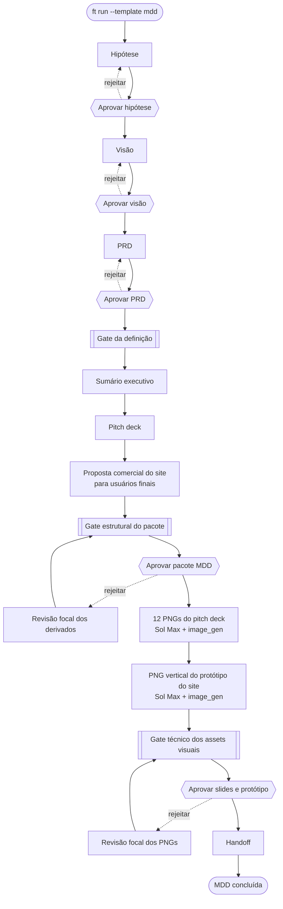

# Fluxo do template Desenvolvimento Orientado ao Mercado (MDD)

A definição é aprovada antes da narrativa. O sumário executivo deriva de
hipótese, visão e PRD; o deck deriva do sumário; a proposta comercial do site
deriva da narrativa consolidada e fala diretamente ao usuário final. Somente
após a aprovação textual, nodes fixados em
`gpt-5.6-sol`/`max` produzem 12 PNGs de slides e um PNG vertical do site. O
`ft close` promove os documentos, bitmaps e receipts canônicos. O template não
muda a fase do projeto nem assume o papel de builder.
