# Fluxograma — MVP Builder Fast (process.yml v1.18.0)

Fluxo principal do template `mvp-builder-fast`. Uma sessão LLM é mantida por
sprint; `⑂` indica lanes paralelas e `R` indica a lane independente de review.

```mermaid
flowchart TD
    START([ft run]) --> PLAN["Plano interno<br/>state/llm_execution_plan.yml"]
    PLAN --> MDD[["Validar hipótese + PRD<br/>produzidos pelo template mdd"]]
    MDD --> UI

    subgraph S2["Sprint 02 — Planning · sessão s2 + lanes"]
        UI{"Critérios UI existem?"}
        UIQ{{"Perguntas UI"}}
        UICREATE["Criar critérios UI"]
        UIG{{"Revisão critérios UI"}}
        BACKLOG{"Backlog existe?"}
        FEATURES{"Features existem?"}
        FULL["Fundação completa<br/>backlog + features + tasks + stack"]
        FEAT["Completar fundação<br/>features + tasks + stack"]
        EXIST["Planejar ciclo<br/>tasks + stack"]
        TECHFIX["Corrigir tech stack"]
        TECHG{{"Revisão tech stack"}}
        API["⑂ Contrato API"]
        UIC["⑂ Critérios UI"]
        DATA["⑂ Massa de dados"]
        MOCKUPS["Gerar mockups P0<br/>Codex ChatGPT + $imagegen"]
        MOCKREVIEW["R Coerência PRD–mockups"]
        MOCKG{{"Revisão humana dos mockups"}}
        PG[["Gate Planning"]]

        UI -- não --> UIQ --> UICREATE --> UIG --> BACKLOG
        UIG -. reject .-> UICREATE
        UI -- sim --> BACKLOG
        BACKLOG -- não --> FULL --> TECHG
        BACKLOG -- sim --> FEATURES
        FEATURES -- não --> FEAT --> TECHG
        FEATURES -- sim --> EXIST --> TECHG
        TECHG -. reject .-> TECHFIX --> TECHG
        TECHG --> API
        TECHG --> UIC
        TECHG --> DATA
        API --> MOCKUPS
        UIC --> MOCKUPS
        DATA --> MOCKUPS
        MOCKUPS --> MOCKREVIEW --> MOCKG --> PG
        MOCKG -. reject .-> MOCKUPS
    end

    subgraph S3["Sprint 03 — Superfície · sessão s3 + review R"]
        FRONT["Construir frontend P0"]
        REVIEW["R Revisão visual"]
        FG[["Gate visual pré-backend"]]
        FIXFRONT["Correção em lote dos findings visuais"]
        FRONT --> REVIEW --> FG
        REVIEW -. on_fail .-> FIXFRONT --> REVIEW
    end

    PG --> FRONT

    subgraph S4["Sprint 04 — TDD · sessão s4"]
        RED["RED"]
        GREEN["GREEN"]
        REFACTOR["Refactor"]
        TG[["Gate TDD"]]
        INTEGRATED["R Revisão integrada<br/>UI → API → persistência → UI"]
        FIXINTEGRATED["Correção em lote dos findings integrados"]
        IG[["Gate integrado"]]
        RED --> GREEN --> REFACTOR --> TG
        TG --> INTEGRATED --> IG
        INTEGRATED -. on_fail .-> FIXINTEGRATED --> INTEGRATED
    end
    FG --> RED

    subgraph S5["Sprint 05 — Delivery · sessão s5"]
        DELIVERY["Entrypoint + self-review + Makefile + serve.sh"]
        DG[["Gate Delivery"]]
        DELIVERY --> DG
    end
    IG --> DELIVERY

    subgraph S6["Sprint 06 — Smoke · sessão s6"]
        SMOKE["Smoke real"]
        SG[["Gate Smoke"]]
        SMOKE --> SG
    end
    DG --> SMOKE

    subgraph S7["Sprint 07 — Acceptance · sessão s7"]
        ACCEPT["Acceptance CLI"]
        AG[["Gate Acceptance"]]
        ACCEPT --> AG
    end
    SG --> ACCEPT

    subgraph S8["Sprint 08 — E2E · sessão s8"]
        E2E["Configurar + executar + screenshots + relatório"]
        EG[["Gate E2E"]]
        E2E --> EG
    end
    AG --> E2E

    subgraph S9["Sprint 09 — Final · sessão s9"]
        VISUAL["Verificação visual"]
        VG[["Gate visual"]]
        STAKE{{"Validação stakeholder"}}
        SFIX["Correção stakeholder"]
        VISUAL --> VG --> STAKE
        STAKE -. reject .-> SFIX --> STAKE
    end
    EG --> VISUAL

    subgraph S10["Sprint 10 — Handoff · sessão s10 + lanes"]
        CONS["Retro + backlog + features"]
        BG[["Validar backlog"]]
        FCG[["Validar features"]]
        PRDN["⑂ PRD.next"]
        CRIT["⑂ Análise crítica"]
        FLIGHT["Plano de voo + handoff"]
        OPAUDIT["R Auditoria operacional<br/>dados reais + restart + legibilidade"]
        OPFIX["Correção focal operacional"]
        OPG[["Gate operacional"]]
        HG{{"Revisão handoff"}}
        EVOLVE["Melhoria do processo"]
        CONS --> BG --> FCG
        FCG --> PRDN
        FCG --> CRIT
        PRDN --> FLIGHT
        CRIT --> FLIGHT
        FLIGHT --> OPAUDIT --> OPG --> HG --> EVOLVE
        OPAUDIT -. on_fail .-> OPFIX --> OPAUDIT
        HG -. reject .-> FLIGHT
    end
    STAKE --> CONS

    EVOLVE --> EXP["Exploração opcional"] --> END([MVP entregue])

    classDef decision fill:#fff3cd,stroke:#b8860b,color:#000
    classDef human fill:#f8d7da,stroke:#a71d2a,color:#000
    classDef gate fill:#d1ecf1,stroke:#0c5460,color:#000
    classDef work fill:#e2e3f5,stroke:#4a4a8a,color:#000
    class PRD,UI,BACKLOG,FEATURES decision
    class HIPG,PRDG,UIQ,UIG,TECHG,MOCKG,STAKE,HG human
    class MDD,PG,FG,TG,DG,SG,AG,EG,VG,BG,FCG,OPG gate
```

O plano é consultivo. Decisions, validators, retries e human gates continuam
sob controle do Python. RED, GREEN e refactor permanecem turns separados.
