# Fluxograma — MVP Builder (process.yml v1.2.0)

Fluxo completo do template `mvp-builder`, gerado a partir de `templates/mvp-builder/process.yml`.

**Legenda de formas:**

- Losango `{ }` — `decision` (roteamento determinístico por condição)
- Hexágono `{{ }}` — `human_gate` (aprovação do stakeholder; seta tracejada = reject)
- Sub-rotina `[[ ]]` — `gate` (validação determinística em Python)
- Retângulo — nodes de trabalho do LLM (`discovery`, `document`, `build`, `review`, `test_*`, `refactor`, `retro`, `exploration`)
- Setas tracejadas — caminhos de rejeição (`reject_next`) ou falha (`on_fail.goto`)

```mermaid
flowchart TD

    START([ft run]) --> ROUTE

    %% ============ HyperMode ============
    subgraph HYPER["HyperMode — roteamento inicial"]
        ROUTE{"PRD existe?<br/>docs/PRD.md"}
        UIROUTE{"Critérios de UI existem?<br/>docs/ui_criteria.md"}
        HYPERQ{{"Perguntas para<br/>Critérios Visuais"}}
        HYPERUI["Descobrir Critérios<br/>Visuais de UI<br/><i>(discovery)</i>"]
        HYPERGATE{{"Revisão dos<br/>Critérios Visuais"}}
        BLROUTE{"Backlog existe?<br/>docs/PROJECT_BACKLOG.md"}
        FEATROUTE{"Catálogo de Features existe?<br/>docs/FEATURES.md"}
    end

    ROUTE -- sim --> UIROUTE
    ROUTE -- não --> HIPOTESE
    UIROUTE -- sim --> BLROUTE
    UIROUTE -- não --> HYPERQ
    HYPERQ --> HYPERUI
    HYPERUI --> HYPERGATE
    HYPERGATE -.->|reject| HYPERUI
    HYPERGATE --> BLROUTE
    BLROUTE -- sim --> FEATROUTE
    BLROUTE -- não --> PBACKLOG
    FEATROUTE -- sim --> TASKLIST
    FEATROUTE -- não --> FEATCAT

    %% ============ Sprint 01 — MDD ============
    subgraph S01["Sprint 01 — MDD"]
        HIPOTESE["Capturar Hipótese<br/><i>(discovery)</i><br/>→ docs/hipotese.md"]
        HIPGATE{{"Revisão da Hipótese"}}
        PRD["Redigir PRD<br/><i>(document)</i><br/>→ docs/PRD.md"]
        PRDGATE{{"Revisão do PRD"}}
        MDDGATE[["Gate MDD"]]
    end

    HIPOTESE --> HIPGATE
    HIPGATE -.->|reject| HIPOTESE
    HIPGATE --> PRD
    PRD --> PRDGATE
    PRDGATE -.->|reject| PRD
    PRDGATE --> MDDGATE
    MDDGATE --> UIROUTE

    %% ============ Sprint 02 — Planning ============
    subgraph S02["Sprint 02 — Planning"]
        PBACKLOG["Criar Project Backlog<br/><i>(document)</i><br/>→ docs/PROJECT_BACKLOG.md"]
        FEATCAT["Criar Catálogo de Features<br/><i>(document)</i><br/>→ docs/FEATURES.md"]
        TASKLIST["Criar Task List<br/><i>(document)</i><br/>→ docs/task_list.md"]
        TECHSTACK["Definir Tech Stack<br/><i>(document)</i><br/>→ docs/tech_stack.md"]
        TECHGATE{{"Revisão do Tech Stack"}}
        APICONTRACT["Definir Contrato de API ⑂<br/><i>(document · plan-docs)</i><br/>→ docs/api_contract.md"]
        UICRITERIA["Gerar Critérios Visuais ⑂<br/><i>(document · plan-docs)</i><br/>→ docs/ui_criteria.md"]
        TESTDATA["Gerar Massa de Dados ⑂<br/><i>(document · plan-docs)</i><br/>→ docs/test_data.md"]
        PLANGATE[["Gate Planning"]]
    end

    PBACKLOG --> FEATROUTE
    FEATCAT --> TASKLIST
    TASKLIST --> TECHSTACK
    TECHSTACK --> TECHGATE
    TECHGATE -.->|reject| TECHSTACK
    TECHGATE --> APICONTRACT
    APICONTRACT --> UICRITERIA
    UICRITERIA --> TESTDATA
    TESTDATA --> PLANGATE
    PLANGATE --> SCAFFOLD

    %% ============ Sprint 03 — Frontend ============
    subgraph S03["Sprint 03 — Frontend"]
        SCAFFOLD["Scaffold Frontend<br/><i>(build)</i><br/>→ project/frontend/"]
        FEIMPL["Implementar Frontend<br/><i>(build)</i>"]
        PRDREVIEW["Revisão PRD — Conformidade<br/><i>(review)</i>"]
        SCREENREV["Screenshot Review<br/><i>(review)</i><br/>→ docs/screenshot-review.md"]
        FEGATE[["Gate Frontend"]]
    end

    SCAFFOLD --> FEIMPL
    FEIMPL --> PRDREVIEW
    PRDREVIEW -.->|on_fail + human_gate| FEIMPL
    PRDREVIEW --> SCREENREV
    SCREENREV -.->|on_fail + human_gate| FEIMPL
    SCREENREV --> FEGATE
    FEGATE --> RED

    %% ============ Sprint 04 — TDD (Backend) ============
    subgraph S04["Sprint 04 — TDD (Backend)"]
        RED["Red — Escrever Testes<br/><i>(test_red)</i><br/>→ project/tests/"]
        GREEN["Green — Implementar Backend<br/><i>(test_green)</i><br/>→ project/backend/"]
        REFACTOR["Refactor<br/><i>(refactor)</i>"]
        TDDGATE[["Gate TDD"]]
    end

    RED --> GREEN
    GREEN --> REFACTOR
    REFACTOR --> TDDGATE
    TDDGATE --> ENTRYPOINT

    %% ============ Sprint 05 — Delivery ============
    subgraph S05["Sprint 05 — Delivery"]
        ENTRYPOINT["Criar Entry Point HTTP<br/><i>(build)</i><br/>→ project/backend/main.py"]
        SELFREVIEW["Self-Review<br/><i>(refactor)</i>"]
        MAKEFILE["Criar Makefile + serve.sh<br/><i>(build)</i>"]
        DELIVGATE[["Gate Delivery"]]
    end

    ENTRYPOINT --> SELFREVIEW
    SELFREVIEW --> MAKEFILE
    MAKEFILE --> DELIVGATE
    DELIVGATE --> SMOKE

    %% ============ Sprint 06 — Smoke ============
    subgraph S06["Sprint 06 — Smoke"]
        SMOKE["Smoke Test<br/><i>(build · env_setup sobe servidor)</i><br/>→ docs/smoke-report.md"]
        SMOKEGATE[["Gate Smoke"]]
    end

    SMOKE --> SMOKEGATE
    SMOKEGATE --> ACCEPTANCE

    %% ============ Sprint 07 — Acceptance ============
    subgraph S07["Sprint 07 — Acceptance"]
        ACCEPTANCE["Acceptance Test CLI<br/><i>(build)</i><br/>→ acceptance-report.md + result.json"]
        ACCGATE[["Gate Acceptance"]]
    end

    ACCEPTANCE --> ACCGATE
    ACCGATE --> E2ESETUP

    %% ============ Sprint 08 — E2E ============
    subgraph S08["Sprint 08 — E2E"]
        E2ESETUP["E2E Browser — Configurar<br/><i>(build · Playwright)</i><br/>→ project/tests/e2e/"]
        E2ERUN["E2E Screenshots — Executar<br/><i>(build)</i><br/>→ docs/e2e-report.md"]
        E2EGATE[["Gate E2E"]]
    end

    E2ESETUP --> E2ERUN
    E2ERUN --> E2EGATE
    E2EGATE --> VISUALCHECK

    %% ============ Sprint 09 — Final ============
    subgraph S09["Sprint 09 — Final"]
        VISUALCHECK["Verificação Visual Final<br/><i>(build)</i><br/>→ docs/visual-check-report.md<br/>P0_ACCEPTANCE: PASS/FAIL"]
        VCGATE[["Gate Visual Check"]]
        STAKEHOLDER{{"Validação do Stakeholder<br/><i>(serve.sh sobe servidor)</i>"}}
        STAKEFIX["Correção Stakeholder<br/><i>(build)</i>"]
    end

    VISUALCHECK --> VCGATE
    VCGATE --> STAKEHOLDER
    STAKEHOLDER -.->|reject| STAKEFIX
    STAKEFIX --> STAKEHOLDER
    STAKEHOLDER --> RETRO

    %% ============ Sprint 10 — Handoff ============
    subgraph S10["Sprint 10 — Handoff"]
        RETRO["Retro do Ciclo<br/><i>(retro)</i><br/>→ docs/retro.md"]
        BLUPDATE["Atualizar Project Backlog<br/><i>(document)</i><br/>→ PROJECT_BACKLOG.md + backlog-progress.md"]
        FEATUPDATE["Atualizar Catálogo de Features<br/><i>(document)</i><br/>→ docs/FEATURES.md"]
        PRDNEXT["Propor Ajustes ao PRD ⑂<br/><i>(document · handoff-analysis)</i><br/>→ docs/PRD.next.md"]
        CRITICAL["Análise Crítica — LLM ⑂<br/><i>(document · handoff-analysis)</i><br/>→ docs/critical-analysis.md"]
        PLANOVOO["Gerar Plano de Voo<br/><i>(document)</i><br/>→ plano_de_voo.md + handoff.md"]
        HANDOFFGATE{{"Revisão do Handoff"}}
        PROCEVOLVE["Meta-Melhoria do Processo<br/><i>(document)</i><br/>→ process-improvements.md/.yml<br/>+ .ft/process/process.yml"]
    end

    RETRO --> BLUPDATE
    BLUPDATE --> FEATUPDATE
    FEATUPDATE --> PRDNEXT
    PRDNEXT --> CRITICAL
    CRITICAL --> PLANOVOO
    PLANOVOO --> HANDOFFGATE
    HANDOFFGATE -.->|reject| PLANOVOO
    HANDOFFGATE --> PROCEVOLVE
    PROCEVOLVE --> EXPLORE

    %% ============ Exploração + Fim ============
    EXPLORE["Exploração Livre<br/><i>(exploration · opcional)</i><br/>ft explore --skip para pular"]
    FIM([MVP Entregue<br/>ft close --merge full])

    EXPLORE --> FIM

    %% ============ Estilos ============
    classDef decision fill:#fff3cd,stroke:#b8860b,color:#000
    classDef humangate fill:#f8d7da,stroke:#a71d2a,color:#000
    classDef gate fill:#d1ecf1,stroke:#0c5460,color:#000
    classDef work fill:#e2e3f5,stroke:#4a4a8a,color:#000
    classDef terminal fill:#d4edda,stroke:#155724,color:#000

    class ROUTE,UIROUTE,BLROUTE,FEATROUTE decision
    class HYPERQ,HYPERGATE,HIPGATE,PRDGATE,TECHGATE,STAKEHOLDER,HANDOFFGATE humangate
    class MDDGATE,PLANGATE,FEGATE,TDDGATE,DELIVGATE,SMOKEGATE,ACCGATE,E2EGATE,VCGATE gate
    class HIPOTESE,PRD,PBACKLOG,FEATCAT,TASKLIST,TECHSTACK,APICONTRACT,UICRITERIA,TESTDATA,SCAFFOLD,FEIMPL,PRDREVIEW,SCREENREV,RED,GREEN,REFACTOR,ENTRYPOINT,SELFREVIEW,MAKEFILE,SMOKE,ACCEPTANCE,E2ESETUP,E2ERUN,VISUALCHECK,STAKEFIX,RETRO,BLUPDATE,FEATUPDATE,PRDNEXT,CRITICAL,PLANOVOO,PROCEVOLVE,HYPERUI,EXPLORE work
    class START,FIM terminal
```

## Notas

- **⑂ Grupos paralelos** (`ft run --parallel`): `plan-docs` (api_contract, ui_criteria, test_data) e `handoff-analysis` (PRD.next, critical-analysis) rodam em paralelo; no fluxo sequencial seguem a ordem das setas.
- **HyperMode**: quando `docs/PRD.md` já existe, o Sprint 01 (MDD) é pulado inteiro; os decisions seguintes criam sob demanda apenas os artefatos canônicos que faltam (ui_criteria, PROJECT_BACKLOG, FEATURES) antes da task list do ciclo.
- **`on_fail` com human_gate** (Sprint 03): as revisões PRD e Screenshot, ao falharem, pausam num human_gate e voltam para `ft.frontend.02.implement`.
- **Loops de correção**: `ft.final.03.stakeholder_fix` volta para a validação do stakeholder até aprovação; human_gates de documento (`reject_next`) voltam ao node que gerou o artefato.
- **`no_pre_seed`**: task_list, scaffold, implement, smoke, stakeholder_fix e todos os artefatos de handoff nunca herdam conteúdo do ciclo anterior.
- **Executors**: nodes de trabalho usam `executor: claude`; decisions, gates e human_gates usam `executor: python` (determinísticos).
